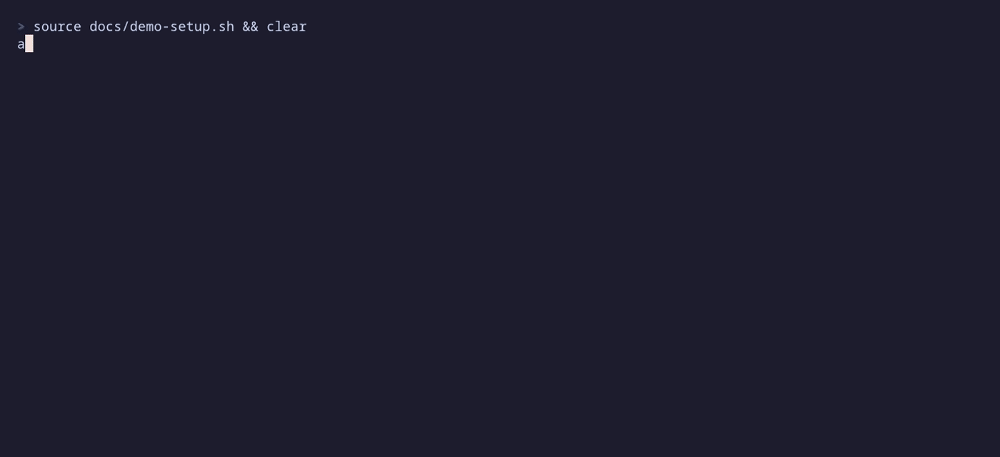

# aaa — capture what you started

You start something, get interrupted, and forget it. `aaa` ("triple A") writes it down in one command, with where you were: repo, branch, directory, terminal, and which coding-agent session you were in.



## Capture

```console
$ aaa add retry to the upload job
m8h  add retry to the upload job
```

No quotes needed. Every word that is not a flag is the text.

## List

```console
$ aaa
  ID   STARTED           TEXT                            GIT   PUSH  PULL  PATH
  k7f  Thu Sep 24 10:41  look into the flaky login test  main         yes  ~/src/example-app/tests
  m2c             15:22  check why the build is slow                       ~/ops
  x4p  Mon Sep 28 16:03  finish the config cleanup       main     2        ~/src/example-lib
  m8h  Fri Oct 2  04:38  add retry to the upload job     main         yes  ~/src/example-app

  4 open, 0 done today
```

Every open item, and what you closed today. PUSH counts commits you have not pushed; PULL says `yes` when the server has something you do not. Both are checked live and stay blank when there is nothing to do.

## Close, fix, inspect

```console
$ aaa --close k7f
closed k7f  look into the flaky login test

$ aaa --close --all
closed 3

$ aaa --edit m2c check why the build is so slow
m2c  check why the build is so slow

$ aaa --show m2c
```

## For coding agents

Every operation takes `--json`:

```console
$ aaa --json --show m8h
{"hash":"m8h","text":"add retry to the upload job","state":"open","created_at":"2026-10-02T02:38:04Z", ...}
```

The binary carries its own agent skill. Install it for Claude Code, then say "put that in triple A":

```console
$ aaa --skill > ~/.claude/skills/aaa/SKILL.md
```

## Install

Linux, amd64 or arm64. Download a release:

```console
$ gh release download --repo air-gapped/aaa --pattern '*linux-amd64.tar.gz'
$ tar xzf aaa-*-linux-amd64.tar.gz && install -m 755 aaa ~/.local/bin/
```

Or build from source with Go:

```console
$ make install
```

## License

MIT
